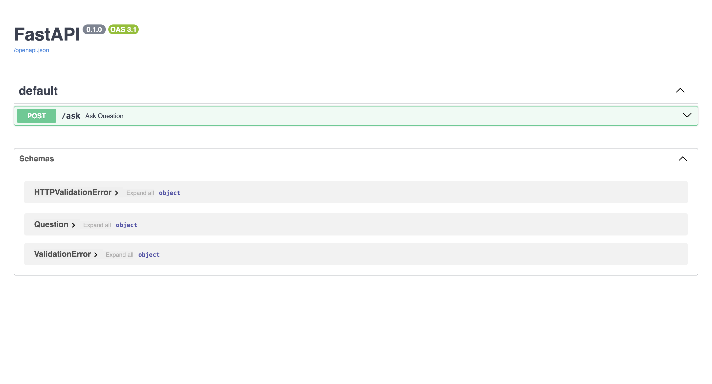
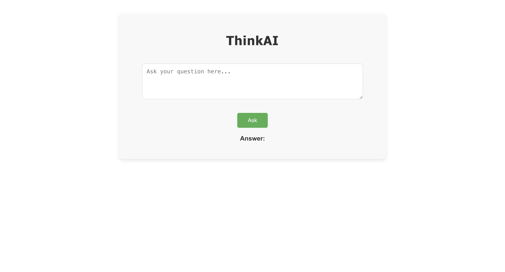

<!DOCTYPE html>
<html lang="en">
<head>
    <meta charset="UTF-8">
    <meta name="viewport" content="width=device-width, initial-scale=1.0">
</head>
<body>

<h1>🚀 ThinkAI: Your AI-Powered Question-Answering System</h1>

ThinkAI is an intelligent question-answering system powered by OpenAI's GPT-3.5 model. Users can ask questions, and the AI responds with accurate and relevant answers in real time. This web application leverages <strong>React.js</strong> for the frontend and <strong>FastAPI</strong> with the <strong>OpenAI API</strong> for the backend.

<h2>✨ Features</h2>

<h3>Real-time Question-Answering</h3>
<ul>
    <li>Ask any question, and get instant, relevant answers powered by GPT-3.5</li>
    <li>Interactive user interface for seamless interaction</li>
    <li>Instantaneous responses for any query</li>
</ul>

<h3>User Interface</h3>
<ul>
    <li>Simple and user-friendly design</li>
    <li>Responsive layout optimized for desktops, tablets, and mobile devices</li>
    <li>Real-time updates of user questions and AI responses</li>
</ul>

<h2>🛠️ Tech Stack</h2>

<h3>Backend</h3>
<ul>
    <li>FastAPI</li>
    <li>OpenAI GPT-3.5 API</li>
    <li>Python 3.8+</li>
    <li>CORS enabled for cross-origin requests</li>
</ul>

<h3>Frontend</h3>
<ul>
    <li>React.js</li>
    <li>React Router for navigation</li>
    <li>Context API for state management</li>
</ul>

<h2>💻 Components Structure</h2>

<h3>Frontend Components</h3>
<pre><code>- App.js            // Main React component
- App.css           // Styles for the frontend</code></pre>

<h3>Backend Components</h3>
<pre><code>- main.py          // FastAPI backend entry point</code></pre>

<h2>🚀 Local Development Setup</h2>

<h3>Backend Setup</h3>

1. Clone the repository
<pre><code>git clone https://github.com/yourusername/thinkai.git
cd thinkai</code></pre>

2. Create a virtual environment
<pre><code>python -m venv venv
source venv/bin/activate  # For Windows: venv\Scripts\activate</code></pre>

3. Install dependencies
<pre><code>pip install -r requirements.txt</code></pre>

4. Set up environment variables (.env)
<pre><code>OPENAI_API_KEY=your-openai-api-key-here</code></pre>

5. Run the backend server
<pre><code>uvicorn main:app --reload</code></pre>

<h3>Frontend Setup</h3>

1. Navigate to the frontend directory
<pre><code>cd frontend</code></pre>

2. Install dependencies
<pre><code>npm install</code></pre>

3. Set up environment variables (.env)
<pre><code>REACT_APP_API_URL=http://localhost:8000</code></pre>

4. Start the frontend server
<pre><code>npm start</code></pre>

<h2>📡 API Endpoints</h2>

<h3>Question-Answering</h3>
<pre><code>POST /ask             - Send a question to the AI for an answer</code></pre>

<h2>🔄 Example Usage</h2>
<pre><code>// Example of sending a question from the frontend
const response = await fetch(${process.env.REACT_APP_API_URL}/ask, {
    method: 'POST',
    headers: { 'Content-Type': 'application/json' },
    body: JSON.stringify({ question: 'What is React.js?' })
});

const data = await response.json();
console.log(data.answer); // Logs the AI-generated answer</code></pre>

<h2>🚀 Deployment</h2>

<h3>Backend Deployment</h3>
<ol>
    <li>Create a new Web Service on Render or your preferred platform</li>
    <li>Set the environment variable for OpenAI API key</li>
    <li>Deploy the backend service with FastAPI and Uvicorn</li>
</ol>

<h3>Frontend Deployment</h3>
<ol>
    <li>Deploy the frontend on platforms like Render, Netlify, or Vercel</li>
    <li>Connect the deployed frontend to the backend API</li>
</ol>

<h2>🔐 Security Features</h2>
<ul>
    <li>Environment variables for API keys</li>
    <li>Cross-origin resource sharing (CORS) protection</li>
</ul>

<h2>🐛 Troubleshooting</h2>
Common issues and solutions:
<ul>
    <li>API errors: Verify your OpenAI API key and network connection</li>
    <li>CORS issues: Ensure your frontend URL is allowed in the backend CORS settings</li>
</ul>

<h2>📱 Responsive Design</h2>
The application is fully responsive and tested on:
<ul>
    <li>Desktop (1200px+)</li>
    <li>Tablet (768px - 1199px)</li>
    <li>Mobile (320px - 767px)</li>
</ul>

<h2>🤝 Contributing</h2>
<ol>
    <li>Fork the repository</li>
    <li>Create a feature branch</li>
    <li>Commit your changes</li>
    <li>Push your branch</li>
    <li>Create a Pull Request</li>
</ol>

<h2>📄 License</h2>

This project is licensed under the MIT License.

Made with ❤️ by Vislavath Pavani

</body>
</html>
